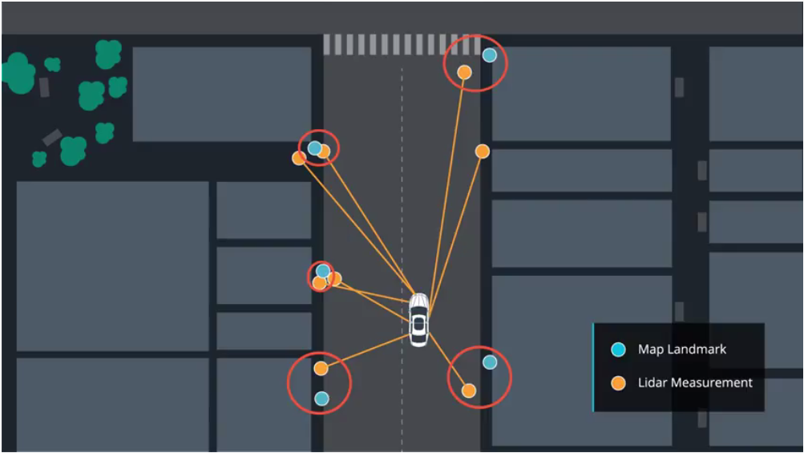
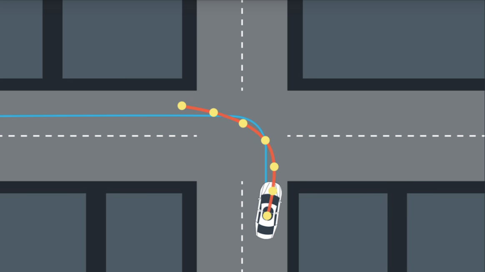
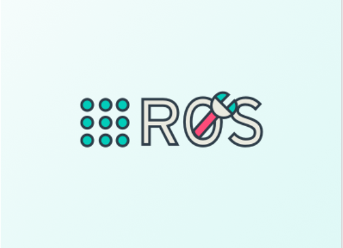

# CarND Projects

---

<a href='https://github.com/raymondngiam/CarND-Behavioral-Cloning-Project'>Behavioral Cloning</a>

Train a deep neural network to drive a car like you!

<a href='https://github.com/raymondngiam/CarND-Advanced-Lane-Finding-Project'>Advanced Lane Finding</a>

Build a pipeline using distortion correction, image rectification, color transforms, and gradient thresholding to identify lane lines and their curvature in a video.

<a href='https://github.com/raymondngiam/CarND-Kidnapped-Vehicle-Project'>Kidnapped Vehicle</a>

Build a particle filter and combine it with a real map to localize a vehicle! 

<a href='https://github.com/raymondngiam/CarND-Model-Predictive-Control-Project'>Model Predictive Control</a>

Implement Model Predictive Control to drive the vehicle around the track even with additional latency between commands!

<a href='https://github.com/raymondngiam/CarND-Path-Planning-Project'>Path Planning</a>

Drive a car down a highway with other cars using a path planner.

<a href='https://github.com/raymondngiam/CarND-Capstone-Project'>Capstone Project</a>

Write ROS nodes to implement core functionality of the autonomous vehicle system, including traffic light detection, control, and waypoint following.

